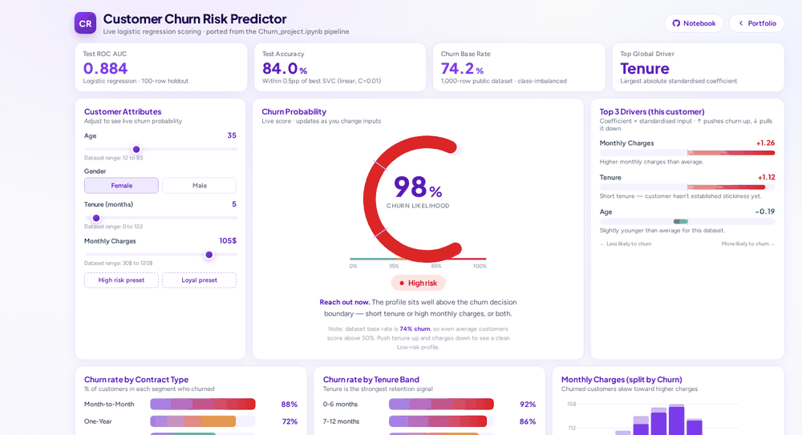

# Customer Churn Risk Predictor

**Live logistic regression scoring in the browser, no Python backend required.**

> Trains five classifiers on a 1,000 row customer churn dataset, picks logistic regression as the final model for interpretability, and ports the trained coefficients to a single file HTML app that scores customers live and explains every prediction.

[**▶ Try the live predictor**](https://dwitibh.github.io/customer-churn-predictor/) · [Open the notebook](Churn_project.ipynb)



*Move tenure up and monthly charges down, the gauge and top driver bars update live in the browser.*

---

## TL;DR

| Metric (100-row holdout) | Value |
|---|---|
| **ROC AUC** | 0.88 |
| **Accuracy** | 84.0% |
| **F1 (churn class)** | 0.90 |
| **Churn base rate** | 74% |
| **Best feature** | Tenure (largest absolute standardised coefficient) |

Five algorithms compared with `GridSearchCV` (cv=5). Logistic Regression and SVC (linear, C=0.01) finished within 0.5pp on accuracy. LR was chosen for the live demo because it ports to client-side JS cleanly and gives interpretable per-feature contribution scores.

---

## The problem

Customer churn datasets are dense and skewed: short-tenure customers on month-to-month contracts churn aggressively, while long-tenured customers on multi-year deals rarely leave. The commercial value is in identifying which individual accounts sit on the wrong side of that boundary, and **why**, so retention teams can intervene before the renewal conversation goes badly.

This project ships:

1. A reproducible classification pipeline that compares five algorithms.
2. A live, single-file HTML demo where anyone can adjust customer attributes and see the churn probability update instantly, with the top three drivers explained.

---

## Dataset

| Column | Type | Notes |
|---|---|---|
| `CustomerID` | int | Identifier |
| `Age` | int | 12 to 83 (mean 44.7) |
| `Gender` | str | Female / Male |
| `Tenure` | int | 0 to 122 months (mean 19.0) |
| `MonthlyCharges` | float | $30 to $120 (mean $74.39) |
| `ContractType` | str | Month-to-Month / One-Year / Two-Year |
| `InternetService` | str | Fiber Optic / DSL / (null) — 297 missing |
| `TotalCharges` | float | $0 to $12,416 (correlated 0.89 with Tenure) |
| `TechSupport` | str | Yes / No |
| `Churn` | str | Yes / No (target) |

**Rows:** 1,000 · **Missing values:** 297 in InternetService (imputed with empty string, no rows dropped).

---

## Methodology

### Preprocessing
- Imputed missing `InternetService` with `""` to preserve all rows.
- Encoded `Gender` as Female=1, Male=0.
- Encoded `Churn` as Yes=1, No=0.
- Selected four features for modelling: `Age`, `Gender`, `Tenure`, `MonthlyCharges`.
- 80 / 20 train / test split.
- `StandardScaler` fit on train, applied to both splits.

### Model comparison

All five models tuned with `GridSearchCV` (cv=5):

| Model | Best params | Test accuracy |
|---|---|---|
| **Logistic Regression** | default (C=1.0, L2) | **0.910** |
| **SVC** | `kernel=linear, C=0.01` | **0.915** |
| KNN | `n_neighbors=7, weights=uniform` | 0.880 |
| Decision Tree | `entropy, max_depth=10, min_samples_split=5` | 0.865 |
| Random Forest | `bootstrap=True, max_features=2, n_estimators=256` | 0.865 |

LR and SVC tied within margin. **LR selected as the final model** for two reasons:
1. **Interpretability** — coefficients are directly readable as standardised log-odds contributions, which the live app uses to surface "top 3 drivers" for each prediction.
2. **Portability** — `(scaler.mean, scaler.std, coef, intercept)` is a tiny JSON payload, so the full pipeline runs in any browser with no Python runtime.

### Results

```
Test ROC AUC:    0.88
Test Accuracy:   0.84
Test Precision:  0.86
Test Recall:     0.93
Test F1:         0.90
```

Confusion matrix (test set, 200 rows): TP=139, TN=29, FP=22, FN=10. Recall is high because the dataset is class-imbalanced toward churn — the model errs on the side of flagging at-risk customers rather than missing them, which is the right side to fail on for a retention use case.

### Key EDA findings

- **Tenure → TotalCharges correlation = 0.89.** Tenure is the dominant retention signal; long-tenured customers rarely churn.
- **Mean MonthlyCharges:** churned customers $76 vs retained $63 — higher charges associate with churn.
- **Contract type drives behaviour:** Month-to-Month churns at 88%, Two-Year at 55% — a 33pp swing on a single attribute.

---

## Live predictor

The trained logistic regression weights, intercept, and scaler statistics are hardcoded into [`index.html`](index.html). Scoring runs entirely in the browser:

```
z = w₀ + Σ wᵢ · (xᵢ − μᵢ) / σᵢ
p = σ(z) = 1 / (1 + e⁻ᶻ)
```


Each prediction shows:
- **Probability gauge** (0% to 100%) with risk band colouring.
- **Risk band** (Low, Medium, High at 35% and 65% thresholds).
- **Top 3 feature drivers** for that specific customer, computed as `wᵢ · (xᵢ − μᵢ) / σᵢ`. Positive contributions push churn up, negative pull it down.
- **Plain English verdict** tied to the risk band.

Open `index.html` directly in a browser, or visit the [GitHub Pages site](https://dwitibh.github.io/customer-churn-predictor/) to interact with it.

---

## How to run

### View the live demo
Just open [`index.html`](index.html) — no install required.

### Reproduce the notebook
```bash
git clone https://github.com/dwitibh/customer-churn-predictor.git
cd customer-churn-predictor
pip install pandas scikit-learn matplotlib jupyter joblib
jupyter notebook Churn_project.ipynb
```
The CSV used for training (`customer_churn_data.csv`) is a public Kaggle dataset; download from your preferred mirror and update the path in cell 1.

## File structure

```
├── Churn_project.ipynb          # Modelling notebook (EDA + 5-model GridSearchCV)
├── index.html                   # Browser-side scorer with embedded LR weights
├── customer_churn_data.csv      # Public dataset (not committed, see above)
├── screenshots/                 # Demo media used in this README
│   ├── demo.gif
│   └── hero.png
└── README.md                    # This file
```

---

## Tech stack

`Python` · `scikit-learn` (LogisticRegression, KNeighborsClassifier, SVC, DecisionTreeClassifier, RandomForestClassifier, GridSearchCV, StandardScaler) · `pandas` · `matplotlib` · `joblib` · Vanilla `JavaScript` + inline `SVG` for the live demo.

---

## Caveats

This is a 1,000-row public dataset with a churn rate around 74%, so a "predict every customer will churn" baseline already lands near 74% accuracy. **What this project demonstrates is the pipeline**: end-to-end data cleaning, encoding, scaling, model comparison with cross-validation, hold-out evaluation, and porting a trained sklearn model to a live browser-side scorer with feature-level explanations.

Production work in this space would add: class-imbalance handling (SMOTE, class weights), calibrated probabilities (isotonic / Platt), tree-based models with SHAP for richer explanations, and a real-time feature store for live scoring against fresh customer data.

---

*Built by [Dwiti Bhavsar](https://www.linkedin.com/in/dwiti-bhavsar-1b955b38) · Senior Data Analyst · [Portfolio](https://dwitibh.github.io/)*

